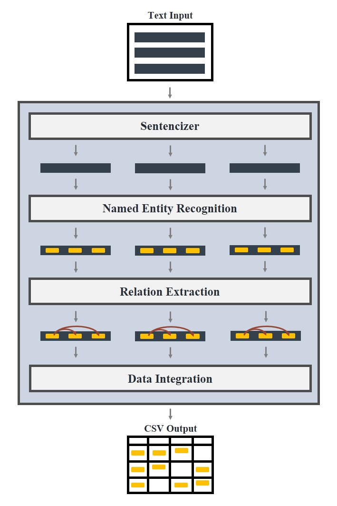
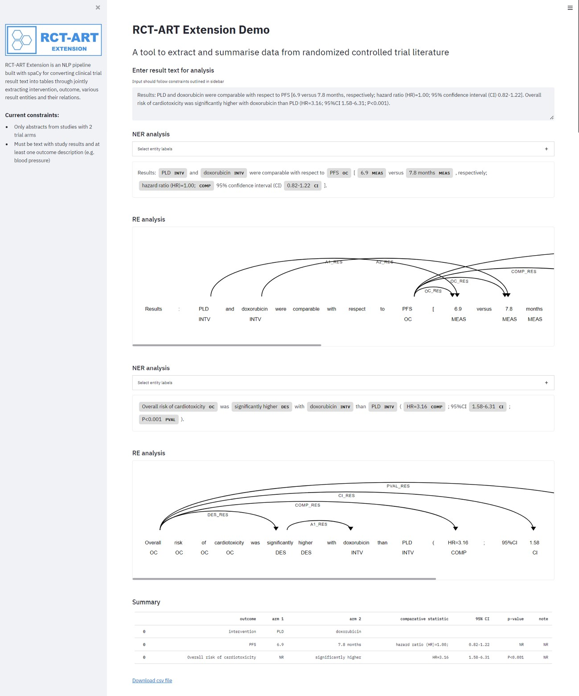
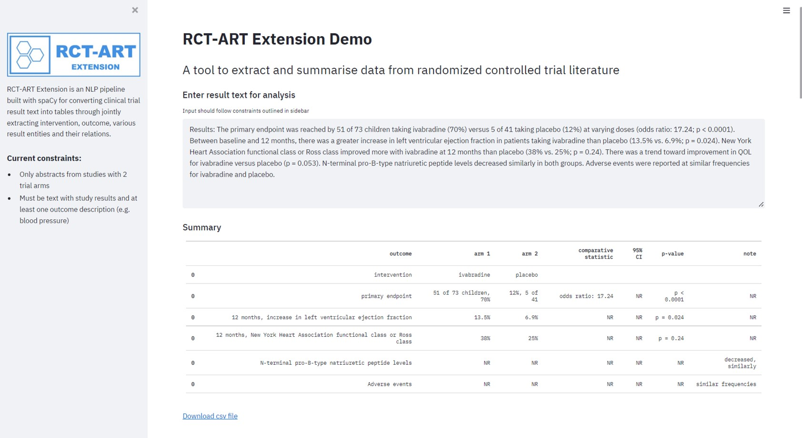

<p align="center"></p>

## Randomised controlled trial abstract result tabulator ##

RCT-ART Extension is an NLP pipeline extended from RCT-ART and a tool for extracting and summarising data from clinical trial literature through jointly extracting entities and their relations.

### Schematic of NLP pipeline design ###
<p align="center"></p>

### Running the system from Python ###

1. Clone this repository and pip installing its dependencies from `requirements.txt`.

2. Download and extract the trained models from [here](https://drive.google.com/file/d/1uYpLTdDR0Mq6BjolIfedP04vVC4qPYsE/view?usp=sharing).

3. Demo the system and run NLP tasks on your browser with the following command:
```bash
streamlit run scripts/demo_extension.py
```

### Demo interface ###
<p align="center"></p>

### Example output ###
<p align="center"></p>


#### References ####
1. Original [RCT-ART](https://github.com/jetsunwhitton/RCT-ART)

2. The relation extraction component was adapted from [spaCy project tutorial](https://github.com/explosion/projects/tree/v3/tutorials/rel_component).